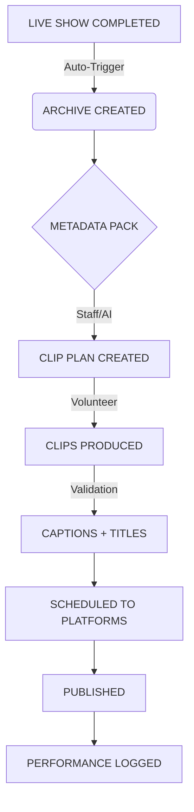

# Content Lifecycle Pipeline Blueprint

**Objective:** Transform a single live stream into maximum social equity with zero friction.

## pipeline_visualization

## STAGE 1: INGEST & ARCHIVE
**Trigger:** Stream Offline Signal
1.  **Live Completed:** System logs end time.
2.  **Archive Created:**
    *   **Primary Source:** YouTube Replay URL.
    *   **Backup:** Local MKV/MP4 upload to Drive (if applicable).
    *   **Action:** Card created in "Content Pipeline" board (Status: `NEEDS_METADATA`).

## STAGE 2: STRATEGY & PLANNING
**Trigger:** Archive Available
3.  **Metadata Pack Completed (Staff):**
    *   **Core Data:** Title, Host, Guests, Key Topics, "Golden Moment" timestamps.
    *   **SEO:** description, tags.
    *   **Status Update:** `READY_FOR_CLIPPING`
4.  **Clip Plan Created (Staff/Lead):**
    *   **Selection:** Identify 3-5 distinct segments per episode.
    *   **Specs per Clip:**
        *   **Duration Target:** 30s, 60s, or 90s.
        *   **Vertical/Hook:** "The Hook" (first 3s) defined structurally.
    *   **Output:** Sub-tasks generated for Video Editors.

## STAGE 3: PRODUCTION
**Trigger:** Clip Plan Finalized
5.  **Clips Produced (Volunteer Editor):**
    *   **Action:** Editor downloads source, cuts clips according to Plan.
    *   **Constraint:** NO creative editing in dashboard. Task is execution of the Plan.
    *   **Upload:** Clean video files (Vertical 9:16) attached to sub-tasks.
6.  **Captions + Titles (Volunteer Assistant):**
    *   **Captions:** Burned-in (Yellow/White - Kingdom Theme).
    *   **Titles:** "Headline" overlay added for scroll-stop capability.
    *   **Status Update:** `READY_FOR_QC`

## STAGE 4: DISTRIBUTION
**Trigger:** QC Approved
7.  **Scheduled to Platforms (Social Lead):**
    *   **Assets:** Final video + Platform Pack (Copy/Tags).
    *   **Tools:** Native schedulers or Buffer/Hootsuite.
    *   **Status Update:** `SCHEDULED`
8.  **Published:**
    *   **Verification:** Live links verified.
    *   **Status Update:** `LIVE`

## STAGE 5: INTELLIGENCE
**Trigger:** 7 Days Post-Publish
9.  **Performance Logged:**
    *   **Metrics:** Views, Watch Time, Click-Through, Subscriber Adds.
    *   **Feedback Loop:** "Top Clip" tagged in `Weekly_Report`.
